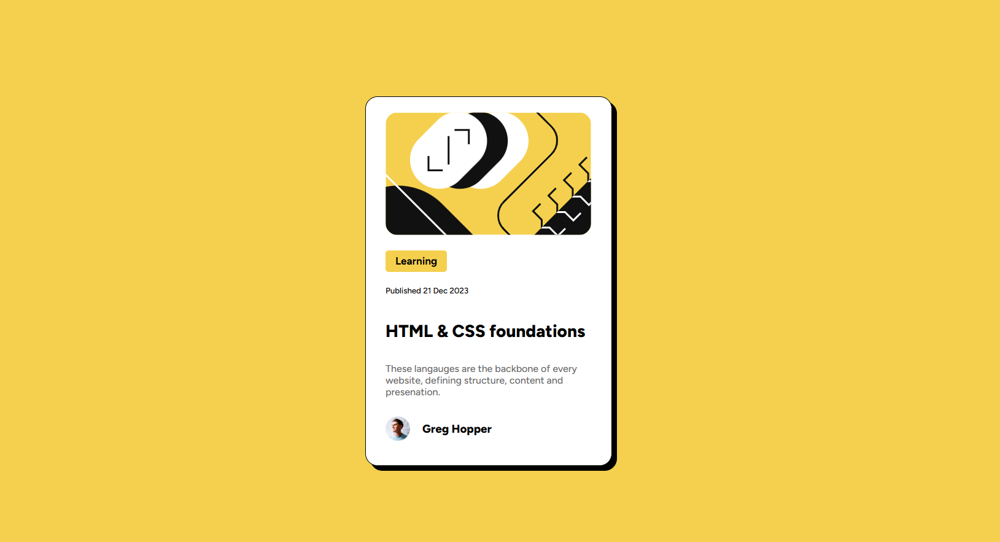

### The challenge

Users should be able to:

- See hover and focus states for the interactive elements on the page.

### Screenshot

### Built with

- Semantic HTML5 markup
- CSS custom properties
- Flexbox

### What I learned

While working on this project, I learned how to structure a simple UI component using semantic HTML and how to use Flexbox to center and organize elements on the page. I also explored creating interactive behavior with CSS hover effects, and I learned how transitions can make animations feel smoother and more natural. I became more aware of how small details—like spacing, color choices, shadows, and timing functions—can significantly improve the overall user experience.

### Continued development

Moving forward, I want to continue improving my front-end skills by experimenting with more advanced CSS techniques, such as animations, transform effects, and responsive layouts. I also plan to learn more about organizing reusable UI components and refining my design skills to create cleaner and more user-friendly interfaces. Additionally, I hope to practice building more small projects like this to strengthen my understanding of layout, styling, and interaction patterns.

### Useful resources

- https://css-tricks.com/snippets/css/a-guide-to-flexbox/ - This helped me understand flexbox better.

